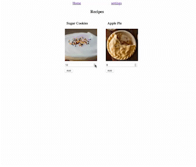

# pyBakery
A simple python based web app to store recipes, and calculate the ingredients required based items being baked and number of servings per item.

## Features
- Create, update, delete recipes
- Create, update, delete ingredients
- Calculate total # of ingredients required across added recipes and servings, converting units to most appropriate unit
### Future
- Add support for auto-conversion of weight to volume and vice-versa by ingredient
- Add support for multiple accounts
- Add support for upload of recipes from csv file

## Quick Demo

Explore more with [live demo](https://pybakery.fly.dev/)
- username: `default`
- password: `pybakery1234`

## Local Installation
### pre-requisites
1. Docker

### Steps
1. Clone the repo
```bash
git clone
```
2. Create key for Django using UUID generator and add this key to the `docker-compose.yml` file
```bash
python -c 'from UUID import uuid4; print(uuid4())'
```
3. Update password for postgres in `docker-compose.yml` file and `settings.py` file
4. Build the docker image and run the container. This will also install the dependencies, and run the migrations.
```bash
docker compose up
```
5. Enter pybakery container, navigate to `app` directory and launch poetry shell
```bash
docker exec -it pybakery bash
cd app
poetry shell
```
6. Create superuser
```bash
python manage.py createsuperuser
```
7. Navigate to `http://localhost:8000/admin` and login with the superuser credentials
